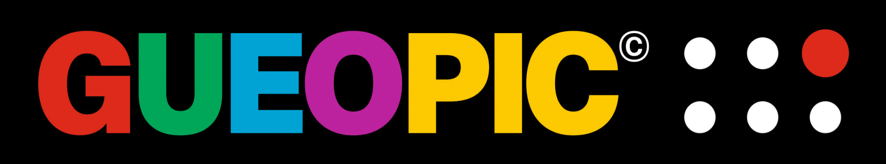

# Gueopic APP - Communication Accessibility for people



> INFORMACIÓN SOBRE LA APP EN **ESPAÑOL**: http://gueopic.com/gueopic-app/

# Index

- [Gueopic APP - Communication Accessibility for people](#gueopic-app---communication-accessibility-for-people)
- [Index](#index)
- [About the project](#about-the-project)
  - [Website](#website)
  - [Download](#download)
- [How to use](#how-to-use)
  - [Set up](#set-up)
  - [Usability (the person who needs to communicate)](#usability-the-person-who-needs-to-communicate)
- [Development](#development)
  - [Requirements](#requirements)
  - [General Set-up](#general-set-up)
  - [Launch the app in the Browser](#launch-the-app-in-the-browser)
  - [Launch the project in Android](#launch-the-project-in-android)
- [Deployment](#deployment)
  - [Android](#android)
- [Developed by](#developed-by)

# About the project

GUEOPIC born by the necessity to improve the communication in an easy way to the autistic people (or with other kind of disabilities) .

> The application can be useful in a lot of cases, is not just for an specific public.

This is a Pictogram application that basically speak a `verb` and an `item` selected by the user.

## Website

You can learn more about GUEOPIC at http://gueopic.com/ (in spanish)

## Download

- **Android:** [https://play.google.com/store/apps/details?id=com.gueopic.gueopic](https://play.google.com/store/apps/details?id=com.gueopic.gueopic)
- **iOs:** Coming soon

# How to use

The application is very easy to use:

## Set up

- Add some verbs (actions).
- Add photos of the items from the person.
- Set custom audios with your voice to each verb and item.

## Usability (the person who needs to communicate)

- Open the app.
- Tap an action.
- Tap an item.

The application will reproduce both elements, so the communication will be very easy.

# Development

## Requirements

- A browser
- node js 14+
- A physical device (optional)
- Anroid Studio and ADB to test in Android
- MAC OS to test in an iPhone

## General Set-up

1. Clone the repo
2. Enter to "source" folder
3. Install node dependences with `npm i`

## Launch the app in the Browser

```bash
npm start
```

## Launch the project in Android

> This will enable angular hot reload, so you don't need to re-launch the native build except you change related to the native libraries (plugins...).

1. Pair your device with the computer
2. Run `npm start:android`
3. Follow the instructions to run the app in the android device
4. If the app is not launched automatically in the device, you will need to open Android Studio and launch it manually (opening the folder `android` as project)

# Deployment

## Android

1. Run the build

```bash
npm run build:android
```

2. In Android Studio (should be automatically opened) just generate a final build in **release** mode.

# Developed by

Coming soon
